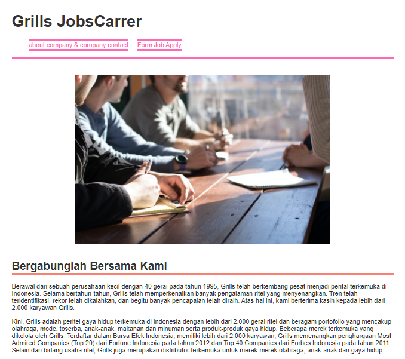
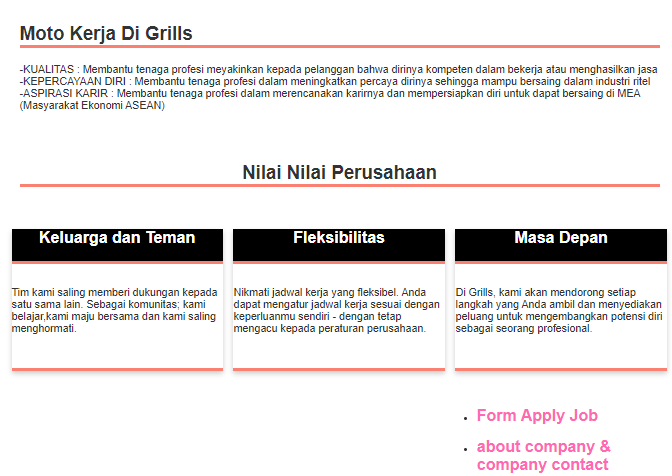
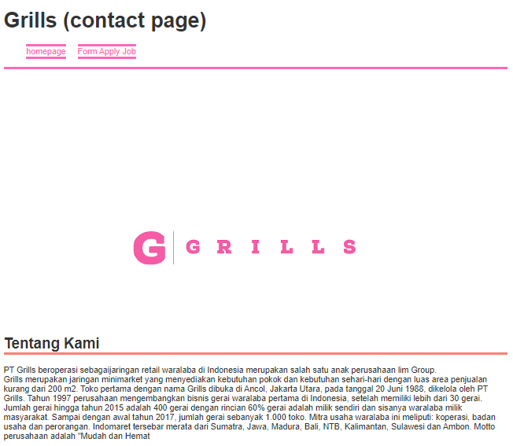
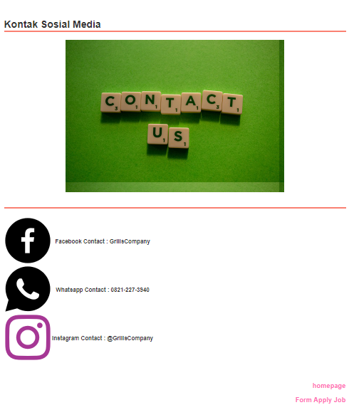
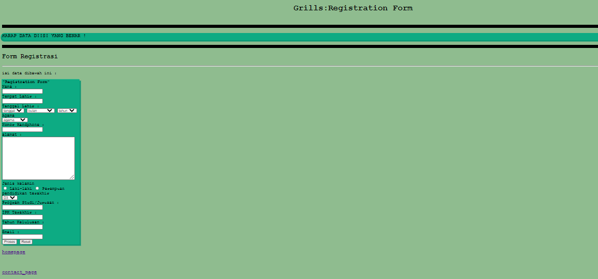
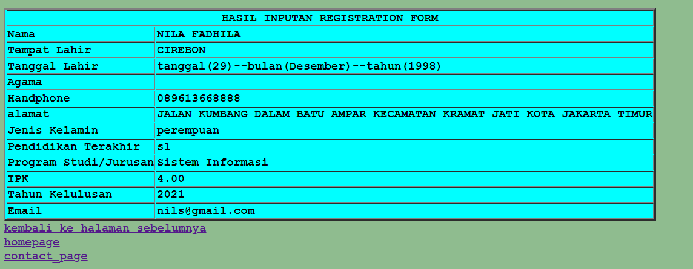

# Project Lowongan Pekerjaan

Ini adalah project kelompok lowongan kerja berbasis website dengan menggunakan kodingan "html + css + php ". dengan beranggotakan 3 orang yaitu:

- Fadila Azhari 
- Nila Fadhila
- Andi Muhammad Yusuf A 

 Fitur yang ada di website:
  - menggunakan css

 kelebihan website:
  - tampilan menggunakan css sehingga tampilan website menjadi lebih menarik untuk dilihat 
  - user dapat mudah menginput form daftar kerja dengan mudah
  
Berikut ini adalah implementasi yang sudah kami buat
- Homepage :

- About Company

- Contact Company

- Input

- OutPut
-

 
